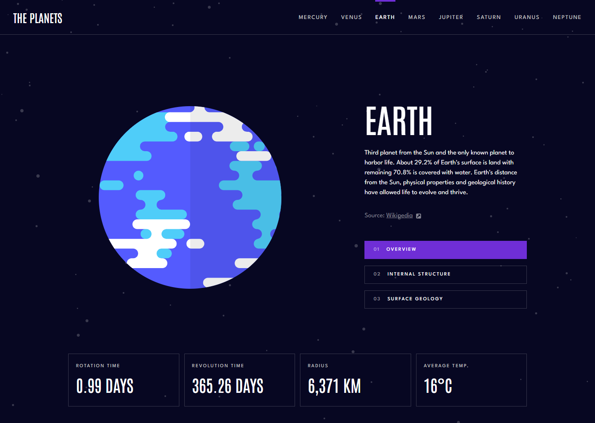
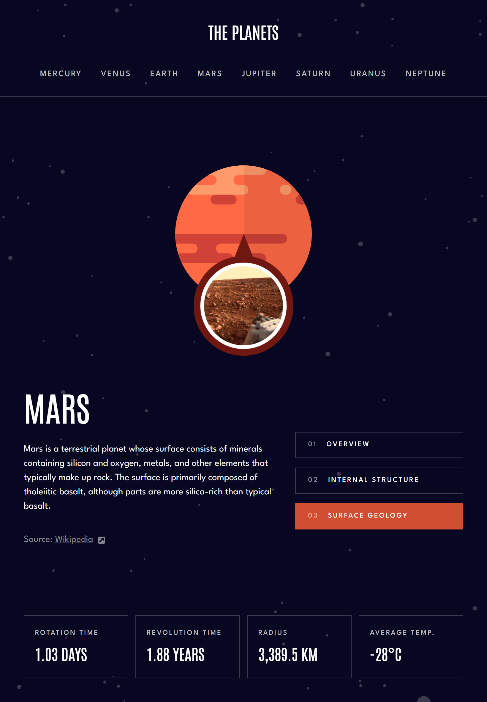
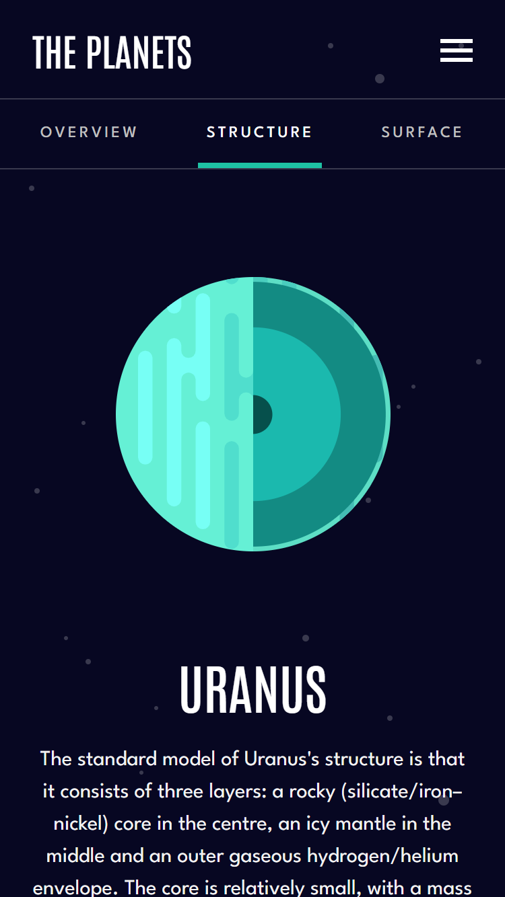

# Frontend Mentor - Planets fact site solution

Live URL: [https://planet-facts-crs.vercel.app/earth](https://planet-facts-crs.vercel.app/earth)

This is a solution to the [Planets fact site challenge on Frontend Mentor](https://www.frontendmentor.io/challenges/planets-fact-site-gazqN8w_f). Frontend Mentor challenges help you improve your coding skills by building realistic projects.

## Table of contents

- [Overview](#overview)
  - [The challenge](#the-challenge)
  - [Screenshots](#screenshots)
- [My process](#my-process)
  - [Built with](#built-with)
  - [What I learned](#what-i-learned)
  - [Useful resources](#useful-resources)

## Overview

### The challenge

Users should be able to:

- View the optimal layout for the app depending on their device's screen size
- See hover states for all interactive elements on the page
- View each planet page and toggle between "Overview", "Internal Structure", and "Surface Geology"

### Screenshots

## My process

### Built with

- React
- react-router
- react-transition-group
- Sass
- CSS Grid

### What I learned

This project was made using React and react-router to make a seemless single page application. I used a package called react-transition-group for applying CSS transitions according to the app's state.
